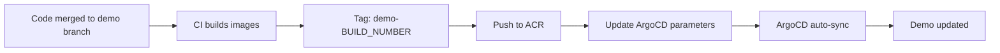

# Demo Environment Setup Guide

## Step 1: Setup Kubernetes Cluster và ArgoCD

### 1.1 Cài đặt ArgoCD
```bash
# Tạo namespace cho ArgoCD
kubectl create namespace argocd

# Cài đặt ArgoCD
kubectl apply -n argocd -f https://raw.githubusercontent.com/argoproj/argo-cd/stable/manifests/install.yaml

# Đợi ArgoCD ready
kubectl wait --for=condition=available --timeout=300s deployment/argocd-server -n argocd

# Lấy password admin
kubectl -n argocd get secret argocd-initial-admin-secret -o jsonpath="{.data.password}" | base64 -d

# Port forward để access ArgoCD UI (chạy ở terminal riêng)
kubectl port-forward svc/argocd-server -n argocd 8080:443
```

### 1.2 Access ArgoCD UI
- URL: https://localhost:8080
- Username: admin
- Password: (từ step trên)

## Step 2: Setup GitOps Repository

### 2.1 Tạo Git Repository cho GitOps
```bash
# Clone hoặc tạo mới GitOps repository
git clone <your-gitops-repo-url>
cd <gitops-repo>

# Copy nội dung từ nash_pisharp_SD5096_operation
cp -r /path/to/nash_pisharp_SD5096_operation/* .

# Commit và push
git add .
git commit -m "Initial GitOps setup for Nash PiSharp"
git push origin main
```

### 2.2 Update Repository URL
Cập nhật `repoURL` trong các ArgoCD files để point đến GitOps repository của bạn:
- argocd/nash-pisharp-applicationset.yaml
- argocd/nash-pisharp-demo.yaml

## Step 3: Deploy Demo Application

### 3.1 Deploy ArgoCD Project và Applications
```bash
# Apply ArgoCD project
kubectl apply -f argocd/nash-pisharp-project.yaml

# Deploy demo application
kubectl apply -f argocd/nash-pisharp-demo.yaml

# Hoặc sử dụng ApplicationSet (deploy tất cả environments)
kubectl apply -f argocd/nash-pisharp-applicationset.yaml
```

### 3.2 Verify Deployment
```bash
# Check ArgoCD applications
kubectl get applications -n argocd

# Check demo namespace
kubectl get all -n nash-pisharp-demo

# Check pods status
kubectl get pods -n nash-pisharp-demo

# Check services
kubectl get svc -n nash-pisharp-demo

# Check ingress
kubectl get ingress -n nash-pisharp-demo
```

## Step 4: Build và Push Docker Images

### 4.1 Build Images cho Demo
```bash
# Build backend image
cd nash_pisharp_SD5096_backend
docker build -t acrnashpisharp.azurecr.io/nash-pisharp/backend:demo-1 .

# Build frontend image  
cd nash_pisharp_SD5096_frontend
docker build -t acrnashpisharp.azurecr.io/nash-pisharp/frontend:demo-1 .

# Push images to registry
docker push acrnashpisharp.azurecr.io/nash-pisharp/backend:demo-1
docker push acrnashpisharp.azurecr.io/nash-pisharp/frontend:demo-1
```

### 4.2 Update Image Tags trong ArgoCD
```bash
# Option 1: Sử dụng script có sẵn
./scripts/update-image-tags.sh demo demo-1 demo-1

# Option 2: Manual update qua ArgoCD CLI
argocd app set nash-pisharp-demo -p frontend.image.tag=demo-1
argocd app set nash-pisharp-demo -p backend.image.tag=demo-1

# Option 3: Update qua ArgoCD UI
# - Access ArgoCD UI
# - Tìm nash-pisharp-demo application
# - Click "Edit" → "Parameters"
# - Update frontend.image.tag và backend.image.tag
```

## Step 5: Setup Domain và Ingress

### 5.1 Configure DNS (Local testing)
```bash
# Add vào /etc/hosts (Linux/Mac) hoặc C:\Windows\System32\drivers\etc\hosts (Windows)
<your-cluster-ip> demo.nash-pisharp.example.com

# Hoặc sử dụng local domain
127.0.0.1 demo.nash-pisharp.local
```

### 5.2 Setup Ingress Controller (nếu chưa có)
```bash
# Install NGINX Ingress Controller
kubectl apply -f https://raw.githubusercontent.com/kubernetes/ingress-nginx/controller-v1.8.2/deploy/static/provider/cloud/deploy.yaml

# Verify ingress controller
kubectl get pods -n ingress-nginx
```

## Step 6: Access Demo Application

### 6.1 Check Application Status
```bash
# Check all resources trong demo namespace
kubectl get all -n nash-pisharp-demo

# Check logs
kubectl logs -f deployment/nash-pisharp-frontend -n nash-pisharp-demo
kubectl logs -f deployment/nash-pisharp-backend -n nash-pisharp-demo
kubectl logs -f deployment/nash-pisharp-mongodb -n nash-pisharp-demo
```

### 6.2 Access Application
```bash
# Method 1: Qua Ingress (nếu đã setup DNS)
curl https://demo.nash-pisharp.example.com

# Method 2: Port forward (cho local testing)
kubectl port-forward svc/nash-pisharp-frontend-service -n nash-pisharp-demo 3001:3000
# Access: http://localhost:3001

# Method 3: Load balancer (cloud environments)
kubectl get svc -n nash-pisharp-demo
# Sử dụng external IP của load balancer
```

## Step 7: CI/CD Integration cho Demo

### 7.1 Demo Deployment Workflow


### 7.2 Sample CI/CD Script cho Demo
```yaml
# Azure DevOps Pipeline example
- stage: DeployDemo
  condition: eq(variables['Build.SourceBranch'], 'refs/heads/demo')
  jobs:
  - job: DeployToDemo
    steps:
    - script: |
        # Build and push images
        docker build -t $(ACR_NAME)/nash-pisharp/backend:demo-$(Build.BuildNumber) ./backend
        docker build -t $(ACR_NAME)/nash-pisharp/frontend:demo-$(Build.BuildNumber) ./frontend
        
        docker push $(ACR_NAME)/nash-pisharp/backend:demo-$(Build.BuildNumber)
        docker push $(ACR_NAME)/nash-pisharp/frontend:demo-$(Build.BuildNumber)
        
        # Update ArgoCD
        argocd app set nash-pisharp-demo -p frontend.image.tag=demo-$(Build.BuildNumber)
        argocd app set nash-pisharp-demo -p backend.image.tag=demo-$(Build.BuildNumber)
```

## Step 8: Monitoring và Troubleshooting

### 8.1 Health Checks
```bash
# Check application health trong ArgoCD UI
# Hoặc qua CLI:
argocd app get nash-pisharp-demo

# Check sync status
argocd app sync nash-pisharp-demo --dry-run

# Force sync nếu cần
argocd app sync nash-pisharp-demo
```

### 8.2 Common Issues và Solutions
```bash
# Issue 1: Pods không start
kubectl describe pods -n nash-pisharp-demo
kubectl logs <pod-name> -n nash-pisharp-demo

# Issue 2: Image pull errors
kubectl get events -n nash-pisharp-demo
# Check image registry credentials

# Issue 3: Ingress không work  
kubectl describe ingress -n nash-pisharp-demo
# Check ingress controller và DNS

# Issue 4: Database connection issues
kubectl exec -it <backend-pod> -n nash-pisharp-demo -- env | grep MONGO
# Verify MongoDB service và connection string
```

## Step 9: Demo Maintenance

### 9.1 Regular Updates
```bash
# Update demo với latest stable version
./scripts/update-image-tags.sh demo demo-latest demo-latest

# Rollback nếu có issues
argocd app rollback nash-pisharp-demo <previous-revision>
```

### 9.2 Scaling cho Demo
```bash
# Scale manually nếu cần
kubectl scale deployment nash-pisharp-frontend --replicas=2 -n nash-pisharp-demo
kubectl scale deployment nash-pisharp-backend --replicas=2 -n nash-pisharp-demo

# Hoặc update values.yaml và let ArgoCD sync
```

---

## 📋 Demo Environment Checklist

- [ ] Kubernetes cluster ready
- [ ] ArgoCD installed và accessible
- [ ] GitOps repository setup
- [ ] Docker images built và pushed
- [ ] ArgoCD applications deployed
- [ ] DNS/Ingress configured
- [ ] Application accessible
- [ ] CI/CD pipeline configured
- [ ] Monitoring setup
- [ ] Documentation updated