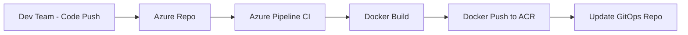
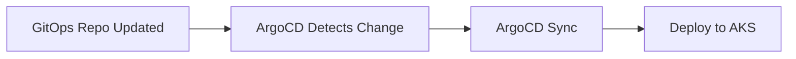

# GitOps Workflow theo Architecture Diagram

## 🔄 True GitOps Pattern (theo diagram)

### Phase 1: Continuous Integration (CI)


**CI Pipeline responsibilities:**
1. Build application images
2. Push images to ACR
3. **Update GitOps repository** (không direct update ArgoCD)

### Phase 2: Continuous Deployment (CD) 


**CD Pipeline (ArgoCD) responsibilities:**
1. Monitor GitOps repository
2. Detect configuration changes
3. Sync to Kubernetes cluster

## 📋 Correct Workflow Steps

### Step 1: Developer commits code
```bash
git add .
git commit -m "Fix frontend bug"
git push origin main
```

### Step 2: CI Pipeline (Azure Pipelines)
```yaml
# azure-pipelines.yml
stages:
- stage: Build
  jobs:
  - job: BuildAndPush
    steps:
    # Build images
    - script: |
        docker build -t $(ACR_NAME)/nash-pisharp/frontend:$(Build.BuildNumber) ./frontend
        docker build -t $(ACR_NAME)/nash-pisharp/backend:$(Build.BuildNumber) ./backend
    
    # Push to ACR
    - script: |
        docker push $(ACR_NAME)/nash-pisharp/frontend:$(Build.BuildNumber)
        docker push $(ACR_NAME)/nash-pisharp/backend:$(Build.BuildNumber)
    
    # Update GitOps repo (NOT direct ArgoCD update)
    - script: |
        git clone $(GITOPS_REPO_URL)
        cd nash-pisharp-gitops
        
        # Update image tags in values or ArgoCD parameters
        sed -i "s/frontend.image.tag=.*/frontend.image.tag=$(Build.BuildNumber)/" \
          argocd/nash-pisharp-demo.yaml
        
        git add .
        git commit -m "Update demo frontend to $(Build.BuildNumber)"
        git push origin main
```

### Step 3: ArgoCD Auto-Detection
- ArgoCD monitors GitOps repository
- Detects changes in `argocd/nash-pisharp-demo.yaml`
- Automatically syncs changes to AKS cluster

## ❌ Anti-pattern (sai)
```bash
# CI Pipeline KHÔNG nên làm điều này:
argocd app set nash-pisharp-demo -p frontend.image.tag=$(Build.BuildNumber)
```

## ✅ Correct pattern (đúng)
```bash
# CI Pipeline nên làm:
# 1. Build & push images
# 2. Update GitOps repo
git clone gitops-repo
echo "frontend.image.tag: $(Build.BuildNumber)" > environments/demo/values.yaml
git commit && git push

# 3. ArgoCD tự động detect và sync
```

## 🎯 Lợi ích của True GitOps:

1. **Git as Source of Truth**: Mọi thay đổi đều qua Git
2. **Audit Trail**: Full history trong Git commits
3. **Rollback dễ dàng**: `git revert` để rollback
4. **Security**: Không cần ArgoCD credentials trong CI pipeline
5. **Separation of Concerns**: CI lo build, CD lo deploy

## 📁 Repository Structure phù hợp:

```
Source Code Repo (Azure Repos):
├── frontend/
├── backend/
└── azure-pipelines.yml

GitOps Repo (separate):
├── charts/nash-pisharp-app/
├── environments/
│   ├── dev/values.yaml
│   ├── demo/values.yaml  
│   └── prod/values.yaml
└── argocd/
```

## 🔧 Implementation:

### Option 1: Update values files
```bash
# CI Pipeline updates environments/demo/values.yaml
frontend:
  image:
    tag: "demo-$(Build.BuildNumber)"
```

### Option 2: Update ArgoCD parameters (current approach)
```bash
# CI Pipeline updates argocd/nash-pisharp-demo.yaml
parameters:
  - name: frontend.image.tag
    value: "demo-$(Build.BuildNumber)"
```

**Recommendation**: Option 1 (values files) is more GitOps-native!