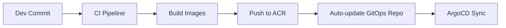

# GitOps Update Workflow - Who Updates What

## 🎯 Workflow Options

### Option 1: Fully Automated (Recommended)



**Who**: CI/CD Pipeline (Automated)
**When**: Every code commit
**How**: Script trong Azure Pipeline

```yaml
# azure-pipelines.yml
- stage: UpdateGitOps
  jobs:
  - job: UpdateImageTags
    steps:
    - checkout: self
      persistCredentials: true
    
    - script: |
        # Clone GitOps repo
        git clone https://$(System.AccessToken)@dev.azure.com/org/gitops-repo.git
        cd gitops-repo
        
        # Update image tags
        sed -i "s/value: \"demo-.*\"/value: \"demo-$(Build.BuildNumber)\"/" \
          argocd/nash-pisharp-demo.yaml
        
        # Commit changes
        git config user.email "pipeline@company.com"
        git config user.name "Azure Pipeline"
        git add .
        git commit -m "Auto-update demo images to $(Build.BuildNumber)"
        git push origin main
      displayName: 'Update GitOps Repository'
```

### Option 2: Semi-Automated (Ops Team + Scripts)

**Who**: Ops Team
**When**: On-demand hoặc scheduled
**How**: Sử dụng scripts có sẵn

```bash
# Ops team workflow
cd nash_pisharp_SD5096_operation

# Update specific environment
./scripts/update-image-tags.sh demo demo-456 demo-456

# Or update only frontend
./scripts/update-frontend.sh demo demo-456

# Script tự động:
# 1. Update ArgoCD files
# 2. Git commit
# 3. Git push
# 4. ArgoCD detect changes
# 5. Auto-sync to cluster
```

### Option 3: Manual (Emergency/Special cases)

**Who**: Ops Team/DevOps Engineer
**When**: Emergency, rollback, special deployments
**How**: Direct file edit

```bash
# Manual emergency update
cd nash_pisharp_SD5096_operation
git checkout main

# Edit directly
nano argocd/nash-pisharp-demo.yaml
# Change: value: "demo-456" to value: "demo-455" (rollback)

git add .
git commit -m "Emergency rollback demo frontend to demo-455"
git push origin main
```

## 🎭 **Roles & Responsibilities**

### Development Team:
- ✅ Write application code
- ✅ Commit to source code repo
- ❌ NO direct access to GitOps repo
- ❌ NO direct ArgoCD access

### CI/CD Pipeline (Automated):
- ✅ Build and test applications
- ✅ Build and push Docker images
- ✅ **Auto-update GitOps repo với new image tags**
- ❌ NO direct ArgoCD API calls

### Ops Team (DevOps Engineers):
- ✅ Manage GitOps repository
- ✅ Manual updates khi cần (emergency, config changes)
- ✅ Monitor ArgoCD sync status
- ✅ Troubleshoot deployment issues

### ArgoCD (Automated):
- ✅ Monitor GitOps repository for changes
- ✅ Auto-sync applications to Kubernetes
- ✅ Report sync status và health

## 🔧 **Implementation Recommendation**

### For Nash PiSharp project:

1. **Primary**: Automated CI/CD update
   ```yaml
   # In Azure Pipeline after building images
   - task: Bash@3
     inputs:
       targetType: 'inline'
       script: |
         # Update GitOps repo
         git clone $(System.AccessToken)@dev.azure.com/thinhnnd/nash-pisharp-gitops.git
         cd nash-pisharp-gitops
         
         # Update image tags using yq or sed
         yq eval '.spec.source.helm.parameters[0].value = "demo-$(Build.BuildNumber)"' \
           -i argocd/nash-pisharp-demo.yaml
         
         git add .
         git commit -m "Update demo to $(Build.BuildNumber)"
         git push origin main
   ```

2. **Backup**: Ops team scripts
   ```bash
   # For manual/emergency updates
   ./scripts/update-image-tags.sh demo demo-emergency demo-emergency
   ```

3. **Emergency**: Direct file edit
   ```bash
   # Last resort - direct edit và commit
   vim argocd/nash-pisharp-demo.yaml
   git commit -am "Emergency fix"
   git push
   ```

## 🎯 **Best Practices**

1. **Separation**: Source code repo ≠ GitOps repo
2. **Automation**: CI pipeline updates GitOps repo
3. **Git as Truth**: All changes via Git commits
4. **No Direct API**: Không direct call ArgoCD API từ CI
5. **Audit Trail**: Full history trong Git logs
6. **Role-based**: Clear responsibilities cho từng team